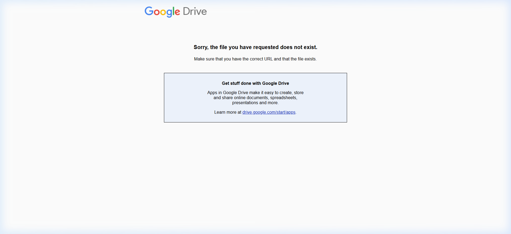
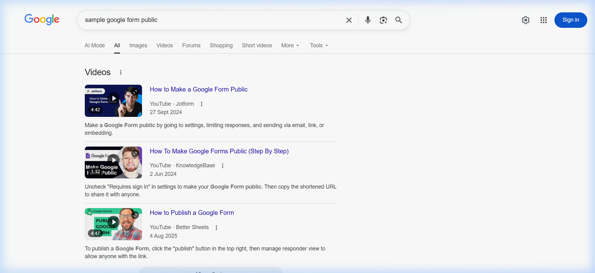
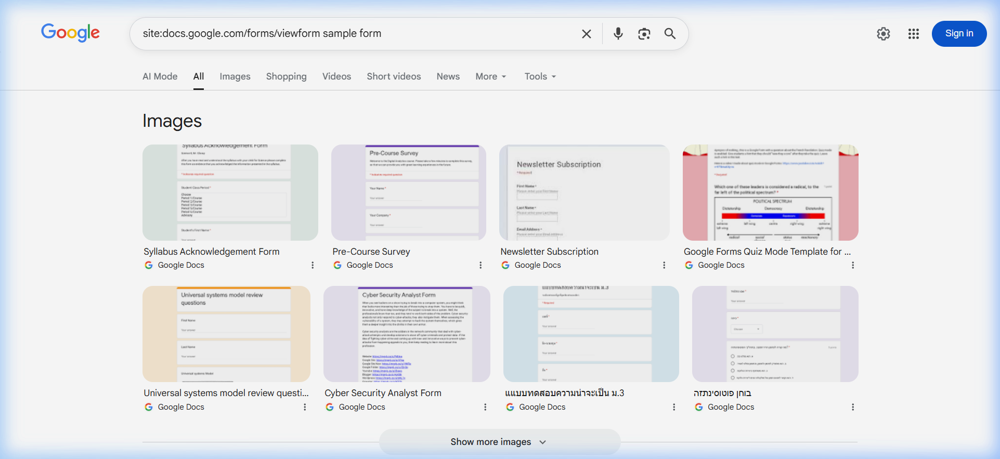
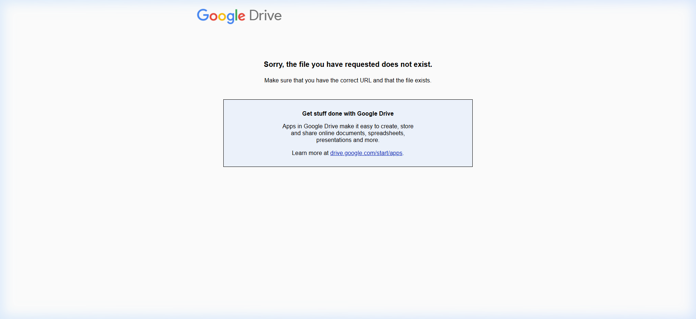
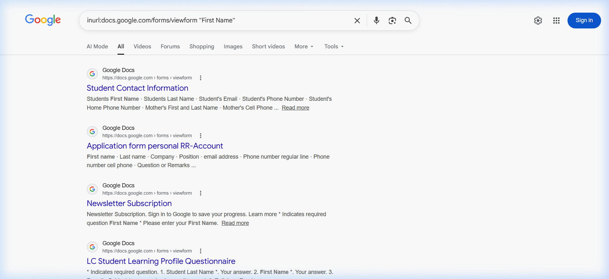

<div align="center">


# FORMA

### A privacy-first, intent-aware autofill assistant for students.

[](https://github.com/chahalgoyal/FORMA/releases/latest)
[](https://developer.chrome.com/docs/extensions/mv3)
[](https://www.typescriptlang.org)
[](https://github.com/chahalgoyal/FORMA)

</div>

---

> **Forma** is a premium, intent-driven browser extension designed to eliminate the friction of campus placement drives. Built for students at institutions like **Chandigarh University (CU)**, it replaces tedious data entry with a "cozy," single-click experience that values accuracy and privacy above all else.

---

## 📸 Experience Walkthrough


### Smart Matching Engine
Forma doesn't just look for exact labels; it understands **intent**.
- **Keyword Matching:** Handles direct hits like "First Name" or "UID."
- **Fuzzy Search:** Powered by **Fuse.js**, it handles typos and synonyms like "Enrollment Number" vs "Roll No."
- **Structural Analysis:** Intelligently detects constraints like "without country code" or "10-digit number."

### Adaptive Learning
When you manually correct a field, Forma notices. It performs a **reverse-lookup** into your profile and asks if it should remember that specific mapping for every future form you encounter.

### The "Cozy Organic" Interface
Forma moves away from sterile, boxy AI designs. The popup and options pages use a **warm, earthy palette** and a unique **plaque-style design** that feels tactile and approachable.
---

## ✨ Full Feature List

### 🧠 Matching & Intelligence
- ✅ **Three-Layer Pipeline:** Keyword → Fuzzy → Structural.
- ✅ **Constraint Awareness:** Detects phone number formats and email types.
- ✅ **Adaptive Learning:** Learns from user corrections in real-time.
- ✅ **Disambiguation:** Knows the difference between "10th Board" and "12th Board" based on context.

### 🎨 UI / UX
- ✅ **Cozy Organic Theme:** Sage green accents, warm beige backgrounds.
- ✅ **Visual Feedback:** 5px side-line indicators and subtle ghost-tint backgrounds.
- ✅ **Real-time Status:** Shows exactly how many fields were filled vs. skipped.
- ✅ **Highlight Clearing:** One-click removal of all visual highlights.

### 🔒 Privacy & Performance
- ✅ **Local-Only Storage:** All profile data stays on your machine (`chrome.storage.local`).
- ✅ **Manifest V3:** Compliant with the latest secure extension standards.
- ✅ **Zero Latency:** No external API calls; matching happens instantly in-browser.
- ✅ **Zero Bloat:** Bundled with **esbuild** for a tiny, fast footprint.

---

## 🏗️ Technical Architecture

```
┌───────────────────────────────────────────────────────────┐
│                     CHROME EXTENSION                      │
│  ┌──────────────┐      ┌──────────────┐      ┌─────────┐  │
│  │    Popup     │ ◄─── │  Storage     │ ───► │ Options │  │
│  │ (User UI)    │      │ (Local JSON) │      │ (Editor)│  │
│  └──────────────┘      └──────────────┘      └─────────┘  │
└──────────┬────────────────────────────────────────────────┘
           │ Messaging API
           ▼
┌───────────────────────────────────────────────────────────┐
│                     CONTENT SCRIPT                        │
│  ┌──────────────┐      ┌──────────────┐      ┌─────────┐  │
│  │  DOM Parser  │ ───► │ Smart Matcher│ ───► │ Filler  │  │
│  │ (Scans Form) │      │ (Three-Layer)│      │ (Logic) │  │
│  └──────────────┘      └──────────────┘      └─────────┘  │
└───────────────────────────────────────────────────────────┘
```

---

## 🚀 Tech Stack

| Layer | Technology | Rationale |
|---|---|---|
| **Core** | TypeScript | Type-safe form mapping and state management |
| **Matching** | Fuse.js | High-performance fuzzy string searching |
| **Build** | esbuild | Sub-millisecond bundling for fast development |
| **Storage** | Chrome Storage API | Secure, per-profile local persistence |
| **Styling** | Vanilla CSS + HSL | Maximum control over the "Cozy Organic" theme |

---

## ⚡ Setup & Installation

### 📥 Quick Install (For Users)
If you aren't a developer, the easiest way to use Forma is via the ZIP release:

1. **Download:** Click the **[Download ZIP](https://github.com/chahalgoyal/FORMA/releases/latest)** badge at the top.
2. **Extract:** Unzip the `forma-extension.zip` folder to a safe location.
3. **Load in Chrome:** 
   - Open Chrome and go to `chrome://extensions/`.
   - Enable **Developer mode** (top-right).
   - Click **Load unpacked** and select the folder you just extracted.
4. **Pin it:** Click the puzzle icon in your browser and pin Forma.

---

## 📖 How to Use

### 1. Setup your Profile
When you first install Forma, click **Edit Profile** in the popup to get started.


### 2. Fill & Save Details
Enter your academic and personal details in the "Cozy Organic" editor and click **Save Profile**.



### 3. Autofill Anywhere
Open any Google Form and click **Autofill This Form**. You can also enable **Autofill on page load** for a zero-click experience.


### 4. Review & Clear
Forma will highlight filled fields in Sage Green. Review the counts in the results panel and clear highlights when done.


---

### 🛠️ Developer Setup (For Contributors)
```bash
# 1. Clone the repository
git clone https://github.com/chahalgoyal/FORMA.git

# 2. Install dependencies
npm install

# 3. Build the extension
npm run build
```
Load into Chrome: Go to `chrome://extensions/` → Enable **Developer mode** → **Load unpacked** → Select the `dist` folder.

---

## 👤 Author

<div align="center">

**Chahal Goyal**

[](https://www.linkedin.com/in/chahalgoyal/)
[](https://github.com/chahalgoyal)

</div>

---

<div align="center">
  <sub>Built with precision and purpose. For the students, by a student.</sub>
</div>
