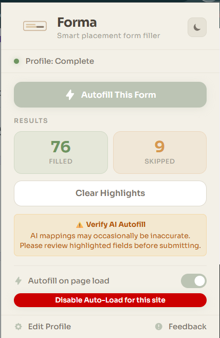
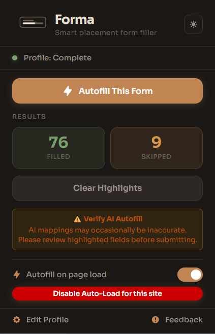
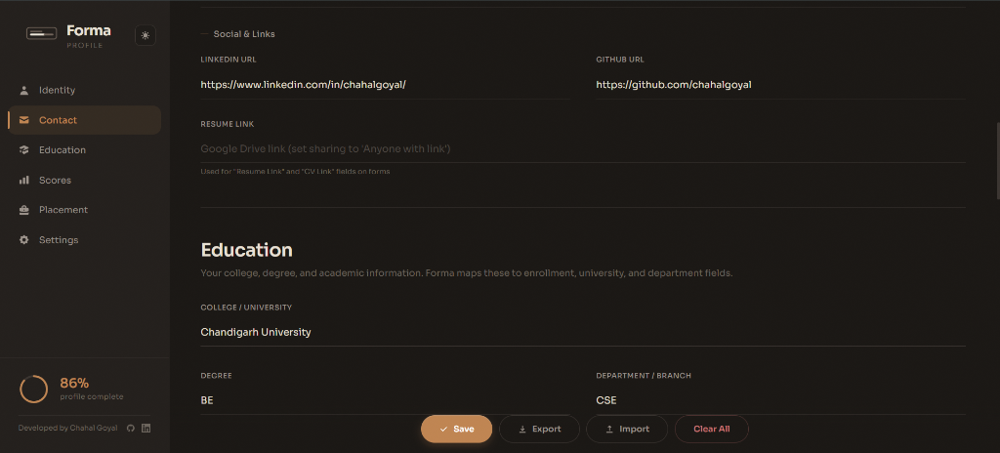
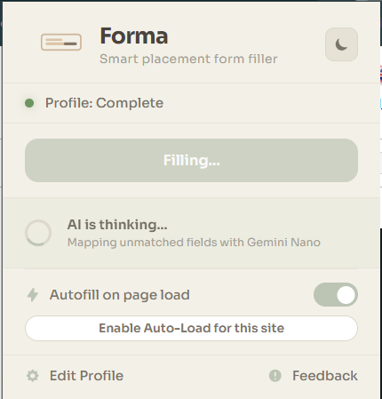
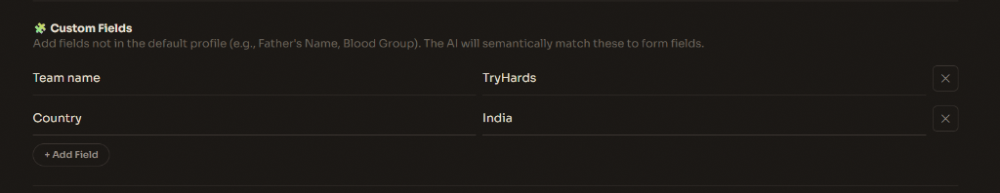

<div align="center">
  <h1>
    <br>
    FORMA
  </h1>
  <h3>AI-Powered, Privacy-First Autofill for Students</h3>

[](https://github.com/chahalgoyal/FORMA/releases/latest)
[](https://chromewebstore.google.com)
[](https://developer.chrome.com/docs/extensions/mv3)
[](https://www.typescriptlang.org)
[](https://deepmind.google/technologies/gemini/nano/)
[](./LICENSE)
[](https://github.com/chahalgoyal/FORMA)

</div>

---

> **Forma** is a premium browser extension that eliminates the tedious, repetitive data entry of campus placement drives. It works on **Google Forms, Microsoft Forms, Greenhouse, Lever, Workday**, and any standard HTML form — filling your details accurately in a single click.
>
> In v2.0.0, Forma introduces a **local AI engine powered by Chrome's built-in Gemini Nano** that semantically maps form fields your keyword matcher can't reach. Everything runs **100% on-device** — no cloud, no API keys, no data leaves your machine.

---

## 📸 Screenshots

<div align="center">

### Popup — Light & Dark Mode
<p>
  
  &nbsp;&nbsp;&nbsp;
  
</p>

### Profile Editor


### Autofill in Action


<sub>Green = filled successfully · Amber = skipped (no matching data)</sub>

### AI Processing
<p>
  
  &nbsp;&nbsp;&nbsp;
  
</p>

<sub>Left: popup spinner during AI inference · Right: on-page toast notification</sub>

### Settings & AI Engine


### Custom Fields


</div>

## 🧠 What Makes Forma Different

### The Problem
During placement season, students fill **dozens of forms** across different platforms — every single one asking for the same 40+ fields. Name, roll number, CGPA, phone, email, address, 10th marks, 12th marks, backlogs, LinkedIn, GitHub... over and over.

Existing autofill tools (Chrome's built-in, LastPass, etc.) are designed for login forms — they don't understand academic fields like "Enrollment Number", "10th Board", or "Active Backlogs".

### The Solution
Forma is built specifically for this use case. It understands the **semantics** of placement forms:

- It knows "UID", "Roll No", "Enrollment Number", and "Student ID" all mean the same thing
- It knows "without country code" means strip the `+91` from your phone number
- It knows the difference between your 10th board and your 12th board
- And when its keyword engine can't figure it out, the **Gemini Nano AI** steps in to map the field semantically — all running locally on your device

---

## ✨ Feature Overview

### 🌐 Universal Platform Support
Forma doesn't just work on Google Forms. Its **Universal Semantic Parser** reads W3C accessibility labels (`aria-labelledby`, `<label for>`, implicit `<label>` wrapping), falls back to heading-based detection for stubborn platforms like Microsoft Forms, and uses a MutationObserver to handle React/Angular SPAs that render inputs asynchronously.

**Tested on:** Google Forms · Microsoft Forms · Greenhouse · Lever · Workday · Any standard HTML `<form>`

### 🧠 Four-Layer Matching Engine
Forma uses a sophisticated pipeline to match each form label to the right profile field:

| Layer | Method | Example |
|-------|--------|---------|
| **1. Keyword** | Direct label matching with synonyms | "First Name" → `name.first` |
| **2. Fuzzy** | Fuse.js-powered approximate matching | "Enrolment No." → `academic.enrollment` |
| **3. Structural** | Constraint detection from context | "Phone (without country code)" → strips `+91` |
| **4. AI (v2.0)** | Gemini Nano semantic key-mapping | "Guardian's Email" → null (no data = no guess) |

### 🤖 Local AI Engine (v2.0 — Gemini Nano)
When the keyword and fuzzy matchers can't find a match, Forma sends the remaining labels to Chrome's **built-in Gemini Nano model** for semantic key-mapping. The AI maps each label to the exact profile key it corresponds to — or returns `null` if there's no match. This means:

- **No hallucinated data** — The AI only maps keys, it never invents values
- **Identity bleed protection** — Bidirectional guard prevents "Father's Phone" from getting your phone number (or vice versa)
- **Strict key validation** — Every AI suggestion is verified against the actual profile keys before being accepted
- **2-minute timeout** — If the AI takes too long, the pipeline gracefully degrades to skip-mode
- **100% local** — Runs entirely on Chrome's built-in model, no network requests

### 📚 Adaptive Learning
When you manually correct a field that Forma filled incorrectly (or missed), Forma detects the change, performs a reverse-lookup into your profile, and asks if it should **remember that mapping** for all future forms.

### 🎨 The "Cozy Organic" Interface
Forma's UI is designed to feel warm, tactile, and premium — not sterile and boxy. Both the popup and the full-page profile editor use a **warm earthy palette** with sage green accents, smooth micro-animations, and a plaque-style design that feels approachable.

Features include:
- **Dark mode** with a single-click icon toggle (sun/moon)
- **Real-time AI status toast** on the page ("Forma AI is processing..." → "Forma filled 12 / 15 fields")
- **Visual field highlighting** — green for filled, amber for skipped
- **Profile completeness ring** showing how much of your profile is filled
- **Custom fields** for any data the preset categories don't cover

### ⚡ Auto-Load System
For sites you use frequently, enable **Autofill on page load** and add domains to your whitelist. Forma will automatically fill forms on those sites the moment the page loads — zero clicks required.

### 📦 Import / Export
Export your entire profile as a clean JSON file and import it on another machine. Custom fields are fully supported in the export format.

### 🔒 Privacy Architecture
- **Zero cloud dependency** — All data stored in `chrome.storage.local`
- **No analytics, no telemetry** — Forma doesn't phone home
- **No API keys** — The AI runs on Chrome's built-in model
- **Manifest V3** — Latest secure extension standard
- **Open source** — Every line of code is auditable

---

## 🏗️ Technical Architecture

```
┌───────────────────────────────────────────────────────────┐
│                     CHROME EXTENSION                      │
│  ┌──────────────┐      ┌──────────────┐      ┌─────────┐ │
│  │    Popup     │ ◄──► │  Storage     │ ◄──► │ Options │ │
│  │ (Quick UI)   │      │ (Local JSON) │      │ (Editor)│ │
│  └──────┬───────┘      └──────────────┘      └─────────┘ │
│         │ chrome.runtime.onMessage                        │
└─────────┼─────────────────────────────────────────────────┘
          ▼
┌───────────────────────────────────────────────────────────┐
│                     CONTENT SCRIPT                        │
│                                                           │
│  ┌──────────────┐    ┌──────────────┐    ┌─────────────┐ │
│  │  Universal   │──► │  4-Layer     │──► │  Adaptive   │ │
│  │  DOM Parser  │    │  Matcher     │    │  Filler     │ │
│  │ (W3C + SPA)  │    │              │    │ (Text/Radio │ │
│  └──────────────┘    │  Keyword     │    │  /Dropdown) │ │
│                      │  Fuzzy       │    └─────────────┘ │
│                      │  Structural  │                     │
│                      │  AI (Nano)   │◄── Gemini Nano API │
│                      └──────────────┘    (On-Device)     │
│                                                           │
│  ┌──────────────┐    ┌──────────────┐                    │
│  │ Highlighter  │    │  Learning    │                    │
│  │ (Visual FB)  │    │  Watcher     │                    │
│  └──────────────┘    └──────────────┘                    │
└───────────────────────────────────────────────────────────┘
```

---

## 🚀 Tech Stack

| Layer | Technology | Purpose |
|---|---|---|
| **Language** | TypeScript 5.0 | Type-safe form matching and profile management |
| **AI** | Gemini Nano (Chrome built-in) | On-device semantic field mapping |
| **Matching** | Fuse.js | High-performance fuzzy string search |
| **Build** | esbuild | Sub-millisecond TypeScript bundling |
| **Storage** | Chrome Storage API | Secure, local-only persistence |
| **Styling** | Vanilla CSS + CSS Variables | Full control over the Cozy Organic theme |
| **Extension** | Manifest V3 | Latest Chrome security standards |

---

## ⚡ Installation

### Chrome Web Store (Recommended)
*Coming soon — pending review.*

### Manual Install (Developer Mode)
1. **Download** the [latest release](https://github.com/chahalgoyal/FORMA/releases/latest) ZIP
2. **Extract** the ZIP to a permanent folder
3. Open Chrome → `chrome://extensions/` → Enable **Developer mode**
4. Click **Load unpacked** → Select the extracted folder
5. **Pin** the Forma icon in your toolbar

### AI Setup (Optional)
The AI engine requires Chrome 128+ and two flags to be enabled:
1. Navigate to `chrome://flags/#prompt-api-for-gemini-nano` → Set to **Enabled**
2. Navigate to `chrome://flags/#optimization-guide-on-device-model` → Set to **Enabled BypassPerfRequirement**
3. **Restart Chrome completely**
4. Open Forma's Edit Profile → Settings → Enable AI → Click **⚡ Initialize & Wake Up AI**
5. Go to `chrome://components` → Find **Optimization Guide On Device Model** → Click **Check for update**

> The model is ~2 GB and downloads in the background. Forma works perfectly fine without AI enabled — the keyword + fuzzy matchers handle the vast majority of fields.

---

## 📖 Usage

### 1. Set Up Your Profile
Click the Forma icon → **Edit Profile**. Fill in your details across the categorized sections: Personal, Contact, Academic, Placement. No field is mandatory — fill only what you need.

### 2. Add Custom Fields
For data that doesn't fit the preset categories (e.g., "Father's Name", "Aadhar Number"), add **Custom Fields** in the Settings tab. These are included in AI mapping.

### 3. Autofill Any Form
Navigate to any form and click **Autofill This Form** in the popup. Watch as fields light up green (filled) or amber (skipped).

### 4. Enable Auto-Load
For forms you fill frequently, toggle **Autofill on page load** and click **Enable Auto-Load for this site**. Forma will fill forms automatically on those domains.

### 5. Review & Submit
Always review AI-filled fields before submitting — the popup shows a warning when AI was used. Highlighted fields make it easy to spot what was changed.

---

## 🛠️ Developer Setup

```bash
# Clone the repository
git clone https://github.com/chahalgoyal/FORMA.git
cd FORMA

# Install dependencies
npm install

# Build the extension
npm run build
```

Load into Chrome: `chrome://extensions/` → Enable **Developer mode** → **Load unpacked** → Select the project root folder.

### Project Structure
```
forma/
├── src/
│   ├── content/          # Content script (DOM parser, filler, highlighter)
│   ├── core/
│   │   ├── ai/           # Gemini Nano integration (aiManager.ts)
│   │   ├── filler/       # Text, radio, dropdown fillers
│   │   ├── matcher/      # Keyword + fuzzy matching engine
│   │   ├── parser/       # Name parser utilities
│   │   └── storage/      # Chrome storage manager
│   ├── background/       # Service worker (message relay)
│   ├── popup/            # Extension popup (HTML + CSS + TS)
│   ├── options/          # Full-page profile editor
│   ├── types/            # Shared TypeScript interfaces
│   └── utils/            # Constants, helpers, selectors
├── assets/               # Icons, logos
├── manifest.json         # Extension manifest (MV3)
├── build.mjs             # esbuild bundler script
└── package.json
```

---

## 📋 Changelog

### v2.0.2 — Stability & Matching Audit
- **React-Safe Fillers:** Ghost fill bug resolved using native setters for text, radio, and select inputs
- **Phone Truncation:** Fixed an issue where international phone numbers were corrupted on field length limits
- **Dropdown Race Conditions:** Patched with a 50ms polling loop and ARIA-controls scoping
- **DOM Parser:** Heading fallback strictly guarded to prevent mislabeling
- **Fuzzy Matcher Hardening:** Prefix threshold tightened (2→3 chars) and ambiguity guard added to route neck-and-neck scores to AI
- **Duplicate-Key Guard:** Prevents the same profile data from ghosting across multiple fields
- **API Warning Suppression:** Chrome LanguageModel API missing-language warning suppressed by routing checks to the Service Worker and probing with `create()`
- **Expanded Vocab:** Added 8 new poison words (e.g., nominee, referee) and 12 stop words for higher matching precision

### v2.0.0 — AI Integration & UX Overhaul
- **Gemini Nano AI Engine:** Local, on-device semantic field mapping for labels the keyword matcher can't reach
- **Key-Mapping Architecture:** AI maps form labels to profile keys (not values), preventing hallucinated data
- **Identity Bleed Protection:** Bidirectional guard against cross-mapping personal and relative data
- **2-Minute AI Timeout:** Graceful degradation if the model takes too long
- **On-Page Toast Notifications:** Real-time feedback during AI processing ("Forma filled 12 / 15 fields")
- **Instant Popup Updates:** Real-time broadcast via `chrome.runtime.onMessage` (replaces polling)
- **AI Processing Loader:** Spinner in popup during AI inference
- **Custom Fields:** User-defined key-value pairs included in AI mapping
- **AI Disclaimer:** Warning banner when AI-filled fields need review
- **Theme-Aware Toast:** Page notifications match light/dark mode
- **Dark Mode Icon Button:** Premium sun/moon toggle matching options page
- **Feedback Link:** Direct GitHub issue reporting from popup footer
- **Import/Export:** Full support for custom fields in JSON profile exports

### v1.2.0 — Platform Independence
- **Universal Semantic Parser:** W3C accessibility-based engine replacing Google Forms-specific parsing
- **Platform Support:** Google Forms, Microsoft Forms, Greenhouse, Lever, Workday, any HTML form
- **SPA Retry:** MutationObserver-based detection for async-rendered forms
- **Whitelisted Auto-Load:** Domain-restricted autofill on page load
- **Quick-Add Popup:** One-click whitelist toggle

### v1.1.0 — UI Polish & Precision
- **Visual Overhaul:** Refined "Cozy Organic" UI with typography alignment
- **Improved Iconography:** Cleaned transparent padding on extension icon
- **Enhanced Matcher:** Better handling of slash-separated fields
- **Automated Bundling:** Streamlined build pipeline

### v1.0.0 — Initial Release
- Three-layer matching engine (Keyword → Fuzzy → Structural)
- Adaptive learning from user corrections
- Constraint-aware filling (phone formats, email types)
- Cozy Organic theme
- Privacy-first, local-only storage

---

## 🤝 Contributing

Contributions are welcome! If you'd like to contribute:

1. Fork the repository
2. Create a feature branch (`git checkout -b feat/your-feature`)
3. Commit your changes (`git commit -m 'feat: add your feature'`)
4. Push to the branch (`git push origin feat/your-feature`)
5. Open a Pull Request

For bug reports, please [open an issue](https://github.com/chahalgoyal/FORMA/issues/new).

---

## 📄 License

This project is licensed under the [MIT License](./LICENSE).

---

## Author

<div align="center">

**Chahal Goyal**

[](https://www.linkedin.com/in/chahalgoyal/)
[](https://github.com/chahalgoyal)

</div>

---

<div align="center">
  <sub>Built with precision and purpose. For the students, by a student.</sub>
</div>
